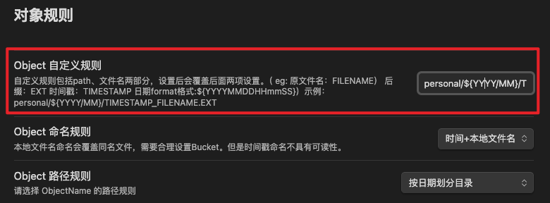

# Obsidian Minio Uploader Plugin

### English | [中文](./README-zh.md)

Upload images, videos, audio, PDFs, and other files to Minio OSS instead of copying them locally. Reduce the size of local disk usage and improve the efficiency of synchronization between multiple devices.

## Preview

Can be paired with [Editing ToolBar](https://github.com/PKM-er/obsidian-editing-toolbar)To use the plugin, add the mini command to the action bar. You can click to select a file, upload it, and add it to the Observer document

## Features

- Supports dragging and dropping files to the editor and directly uploading them to Minio
- Support for directly uploading files to Minio after pasting them into the editor
- Supports command selection of files and uploading to Minio, making it more convenient to use with the Editing ToolBar plugin

## Setting

Firstly, all Minio related configurations must be correctly configured before they can be used normally:

>Tip: API data access port number for Minio

- accessKey
- secretKey
- bucket
- endpoint
- port
- SSL

Secondly, it is necessary to enable anonymous access to files in the Bucket settings of the Minio console, which means that files can be directly accessed through URLs.

## Thanks

This project draws inspiration from the [S3 image uploader](https://github.com/jvsteiner/s3-image-uploader) \ [Editing ToolBar](https://github.com/PKM-er/obsidian-editing-toolbar) plugin

## 版本说明(fork)

### 1.0.3 

Desc：
对象保存path、name新增自定义规则。

[1.0.3](./release/1.0.3/)

自定义规则支持参数类型：

- FILENAME：文件名
- EXT：文件后缀
- FILETYPE：文件类型
- TIMESTAMP：当前时间戳
- ${YYYYMM}：日期formatter

eg. personal/${YYYY/MM}/TIMESTAMP.EXT：包含自定义path、日期格式化、时间戳
